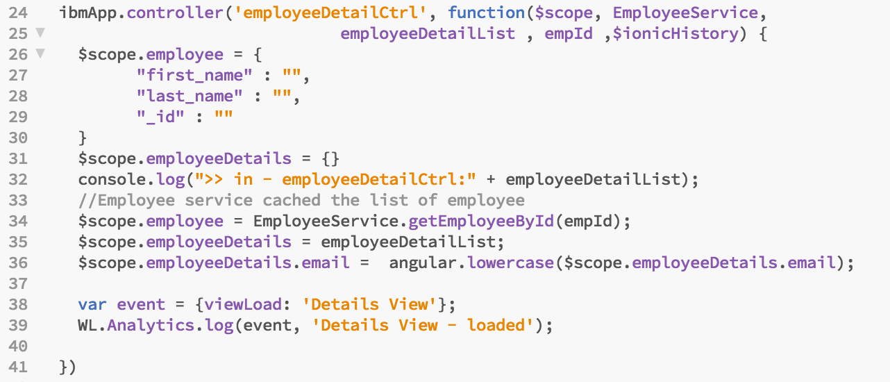
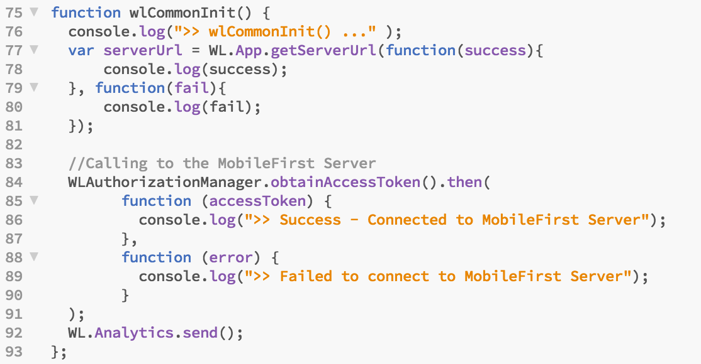
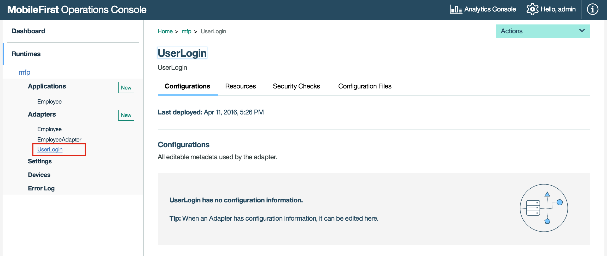
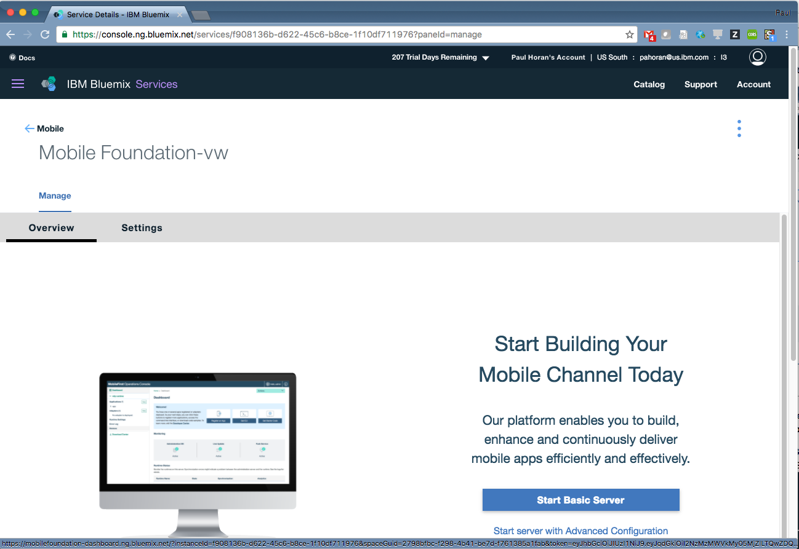

Introduction
============

This set of labs we will demonstrate how to take an existing Ionic/Cordova application and add the MobileFirst Platform v8.0 SDK as well as demonstrate some of the capabilities provided by MobileFirst. The lab will cover bootstrapping, application customization, using MFP 8.0 adapters, MFP 8.0 Operational Analytics, custom report and more.

The activity will start with an Ionic project that has already been created (see git repo below). The application is an Employee Directory application, named IBMEmployeeApp

The following exercise includes the following "micro" labs

-   Pre-requisites
-   Introduction - Understand the Ionic application and learn how to customize it
-   Lab \# 1 - Add MobileFirst SDK and manage your App
-   Lab \# 2 - Using MFP adapters frameworks 
-   Lab \# 3 - Overview MFP Operational Analytics
-   Lab \# 4 - (Optional) How to secure your application 
-   Lab \# 5 - (Optional) Move to MobileFirst on Bluemix


# Pre-Requisites

+ Get a [Bluemix IBM id](https://bluemix.net)
+ Install Git client :  [https://git-scm.com/downloads](https://git-scm.com/downloads)
+ Install Node, Download the latest stable version 4.X
  [https://nodejs.org/en/download/](https://nodejs.org/en/download/)
+ Install Java JDK 1.8 :   [http://www.oracle.com/technetwork/java/javase/downloads/index.html](http://www.oracle.com/technetwork/java/javase/downloads/index.html)
+ Install a advanced Editor : Notepad++, Brackets, Atom, Visual Code 
+ Install MobileFirst Developer kit : [MobileFirst Developer kit](https://mobilefirstplatform.ibmcloud.com/downloads/)
+ Install MobileFirst CLI : `npm install -g mfpdev-cli`
+ Install Maven : https://maven.apache.org/download.cgi

For our Hybrid Mobile App 

+ Install Cordova : `npm install -g cordova@6.1`
+ Install Ionic 1.x : `npm install -g ionic@1.7.6`


To Emulate device
+ Install Android SDK : [https://developer.android.com/studio/index.html](https://developer.android.com/studio/index.html) 

>**Note** : Download command line tools only
> and add the directory in you path to have ``android``` available anywhere.
> Update with the following sdk 

```
android update sdk -u -a -t "tools","platform-tools","build-tools-23.0.3","android-23","sys-img-x86_64-android-23","sys-img-x86_64-google_apis-23"
```


### Source code for labs

In order to get the latest code for the ionic application, go to Home Directory and run the following git command:

~~~~~~~~~~~~~~~~~~~~~~~~~~~~~~~~~~~~~~~~~~~~~~~~~~~~~~~~~~~~~~~~~~~~~~~~~~~~~~~~
git clone https://github.com/eliranbi/IBMEmployeeApp
~~~~~~~~~~~~~~~~~~~~~~~~~~~~~~~~~~~~~~~~~~~~~~~~~~~~~~~~~~~~~~~~~~~~~~~~~~~~~~~~


### Start by previewing the existing Ionic Employee Directory application.


For the username and password use the combination of **demo/demo** to login


  
##MobileFirst Foundation components
###MobileFirst Server

As part of the Developer Kit, the MobileFirst Server is provided pre-deployed on a WebSphere Liberty profile application server. The server is pre-configured with an “mfp” runtime and uses a filesystem-based Apache Derby database.

In the Developer Kit root directory, the following scripts are available to run from a command-line:

    run.[sh|cmd]: Run the MobileFirst Server with trailing Liberty Server messages
        Add the -bg flag to run the process in the background
    stop.[sh|cmd]: Stop the current MobileFirst Server instance
    console.[sh|cmd]: Open the MobileFirst Operations Console

.sh file extensions are for Mac and Linux, and .cmd file extensions are for Windows.

###MobileFirst Operations Console

The MobileFirst Operations Console exposes the following functionalities.
A developer can:

- Register and deploy applications and adapters
- Optionally download native/Cordova application and adapter starter code templates
- Configure an application’s authentication and security properties
- Manage applications:
    - 	Application Authenticity
    -  Direct Update
    -  Remote Disable/Notify
- Send Push Notifications to iOS and Android devices
- Generate DevOps scripts for continuous integration workflows and faster development cycles

###MobileFirst Foundation Command-line Interface

You can use the MobileFirst CLI to develop and manage applications, in addition to using the MobileFirst Operations Console. The CLI command are prefixed with mfpdev and support the following types of tasks:

- Registering apps with the MobileFirst Server
- Configuring your app
- Creating, building, and deploying adapters
- Previewing and updating Cordova apps

###MobileFirst Foundation client SDKs and adapter tooling

MobileFirst Foundation provides client SDKs for Cordova applications as well as for Native platforms (iOS, Android and Windows 8.1 Universal & Windows 10 UWP). Adapter tooling for adapters and security checks development is available as well.

    

#Introduction - Review Ionic Application & Customization


This short lab introduces the Ionic application artifacts and code. 

Steps
-----
If you haven't already done so, run the following commands below to start from a known point for the first lab:


1.  Start a command line terminal (i.e. `cmd` on Windows or `terminal` on OS X and Linux).

1.  Enter in the directory **IBMEmployeeApp** directory (Previously created by git clone command):

    ```
cd IBMEmployeeApp
```

1.  In order to start from a known point for the first lab run the following command:

	```
git checkout -f step-0
```

	> **Note:** this checkout will also add the **/snippets** and **/extras** folders for use in the editing steps later on.

1.  Run the application using the Ionic serve command to start the default browser and point to **localhost:8100/\#/**. This will also track and reload any application code changes.

	```
ionic serve
```
	
	
	
 

1. Review the project structure on the left side 
	
	
	 
  
	- **package.json** - contains all application dependencies.
	- **platfroms directory** - contains the added device platforms that have been added to the project (iOS, Android etc).
	- **plugins directory** - contains the different cordova plugins added to the project.
	- **resource directory** - contains the application splash screen and the app icon for the different platforms (default to Ionic)
	- **scss directory** - contains application color theme definitions.
	- **www directory** - contains application assets such as; css files, images, data files, html files, javascript files etc.
	- **lib directory** - contains the ionic libs and any additional libs that might add.
	- **index.html** - the main html file for the application.
	- **app.js** - the main javascript file for the application.
	- **controllers.js** - JavaScript file containing the controllers that have been defined for each page (view). See [Angular Controllers](https://docs.angularjs.org/guide/controller) for more information.
	- **services.js** - JavaScript file containing service, or network, calls used by the application. See [Angular Services](https://docs.angularjs.org/guide/services) for more information.

1. New review the index.html file

	

	Notice that there are three different sections: 
	
	- The first section adds a reference to the Ionic framework css and javascript files along with reference to custom css style.
	- The second section adds a reference to the app.js, controllers.js and services.js files. These files include the application business, flow, and transaction logic.
	- The third section is the actual bootstrapping of the application. The bootstrap is performed by including the **ng-app** directive to auto bootstrap the app and **ng-controller** directive which attaches a controller class to the view. This is a key aspect of how angular supports the principles behind the Model-View-Controller design pattern.

> **To learn more**, visit the [ng-app](https://docs.angularjs.org/api/ng/directive/ngApp) and [ng-controller](https://docs.angularjs.org/api/ng/directive/ngController) sections of the Angular documentation.

Application Customization
-------	
The demo asset was built in a way that will allow easy customization to match the most common use cases for demos or POCs. The splash and login screens are easily modified by editing the exising PNG files to match a  company logo and color scheme.

The master detail list can represent anything from employees, bank accounts, car insurance policiesor or store locations. 

**Take a look at the image below:**


- To change the **splash/login background** refer to section A
- To change/add **splash/login customer logo** or change the slogo/application name refer to section B
- To change the **buttons color scheme** refer to section C, you can find all the default Ionic color schemes at the following link: [http://ionicframework.com/docs/components/#buttons](http://ionicframework.com/docs/components/#buttons) 
	
8. Open the **splash.html** page under /pages/splash.html and customize your splash to the color scheme and the logo/application name of the last customer you have met.

9. If you look again in your browser you will see the ionic automatically apply and load your changes 


Summary
-------

This lab introduced the Ionic application source code and demonstrated how to easily customize the look and feel to match future POC or custom demo needs.

If you were unable to complete this lab, you can catch up by running this
command:

```
git checkout -f step-1
```


---

# Lab 1 - Add MobileFirst SDK and Manage your App

This lab will use the Cordova CLI to add the MobileFirst (SDK) Cordova plugin into the existing application.

These are the standard steps required to add plugins to an application. Adding the MobileFirst plugin allows the application to use the MobileFirst platform features. 

**General Steps:**

1. Within the IBM Employee application directory, run Cordova CLI command to add a plugin.

1. Add one or more device platforms.

2. Use the MobileFirst CLI to preview the application to ensure the plugin was successfully added. 

##Steps

1. Change context into the MobileFirst project.

        cd IBMEmployeeApp        

2. **Add** the Android platform, run the following command 'cordova platform add android'

	```
	    cordova platform add android
```

3. To add mfp sdk,  **Run** the cordova plugin add cordova-plugin-mfp

	```
        cordova plugin add cordova-plugin-mfp
 	```

	>Note:  To be able to easily debug your application and view your application console log, run the following command to add the cordova console plugin 
	
	```
		cordova plugin add cordova-plugin-console
	```
	
4. To prepare the next Lab, **Start** the MobileFirst server, navigate to your MobileFirst Server installation folder and run the following command
	> **Note:** When you install MobileFirst Developer Toolkit you are able to have a MobileFirst Server instance localy.
	
	> **Note:** Running the add plugin command above will add all the required MFP plugin files from npm. This requires a network connection. For more information on the MFP Cordova Plugin, visit: [https://www.npmjs.com/package/cordova-plugin-mfp](https://www.npmjs.com/package/cordova-plugin-mfp)

4. **Start** the local MobileFirst Server, navigate to the mobile first server installation folder and run the following commands:

	- Open a new terminal session


	```
	cd $HOME\MobileFirst-8.0.0.0

	run -bg
```
	```
Running MobileFirst server in the background.
Starting server mfp.
Server mfp started.
	```	
		
 
5. Go back in the IBMEmployeeApp directory and **Run** the ` mfpdev app preview ` command

	```
	 mfpdev app preview
	```

  

6.  The preview will prompt for using either the simple browser or the mobile browser simulator. Select the simple browser. This will launch the  application using the default browser.

	```
Verifying server configuration...
? Select how to preview your app: (Use arrow keys)
❯ browser: Simple browser rendering 
  mbs: Mobile Browser Simulator 
```

  

> **Tip:** To change the default browser use the `mfpdev config` command.
 

##Summary
This lab enabled the MobileFirst Platform functionality for an existing Ionic/Cordova application by simply issuing the Cordova plugin add command. 

If you were unable to complete this lab, you can catch up by running this command: ** 
**You will still need to add the Android platform and the mfp cordova plugin manually since the plugin folder is not committed to the git repo**

```
git checkout -f step-2
```

- - -
## Initialize MobileFirst SDK and Manage your application 

Previous labs introduced the IBM Employee App and demonstrated how to add device platforms and the MobileFirst 8.0 SDK for Hybrid application. 

To enable the MobileFirst capabilities requires the addition of a few lines of code.  

This lab will demonstrate how to add MobileFirst Platform JavaScript code to the Ionic application source and launch the new application in an emulator.

This lab will also demonstrate using the Mobile Browser Simulator (MBS), one of the components provided with the MobileFirst, to preview the application. 

In contrast to the `cordova emulate` command, the `mfpdev app preview` command does not require a platform emulator (such as Android Virtual Device) - it operates entirely in the browser.  The simulator also enables the use of developer tools such as the debugger, style editor and inspector.

The Mobile Browser Simulator requires a MobileFirst development server to operate.  

> **Note:**  For this lab there are snippets files included in the **/snippets** folder of your root workspace which can be used to quickly copy/paste the large source code blocks below.

##Steps

1.  Open the **IBMEmployeeApp** project using your editor. 

  > **Note:**  You may use any IDE you like to perform the labs.  The examples shown use the Brackets IDE.
  
1. Open the **`app.js`** file in the folder **`IBMEmployeeApp/www/js`** and add the following code immediately after the declaration of ibmApp and just after the **`//Add support for Cordova`** and before the comment **`//application config`**:

  
  
	```javascript
     //Adding support for cordova.
         ibmApp.run(function($ionicPlatform) {
               console.log('>> ibmApp.run ...');
               $ionicPlatform.ready(function() {
                 // Hide the accessory bar by default (remove this to show the accessory bar above the keyboard
                 // for form inputs)
                 console.log('>> ibmApp.ready ...');
                 if (window.cordova && 
                     window.cordova.plugins && 
                     window.cordova.plugins.Keyboard) {
         			    cordova.plugins.Keyboard.hideKeyboardAccessoryBar(true);
                 }
                 if(window.StatusBar) {
                   StatusBar.styleDefault();
                 }
               });
             });
    ```
 
  
  
  > **Tip:** Code snippets for this lab are available in the `snippets/snippets.txt` file.

1. Add code for MobielFirst PlatForm init. 

Within **`app.js`** scroll to the very bottom of the file and add the following code just after the *"// Add MobileFirst configuration stuff."* comment (locate snippet for copy/paste in the **/snippets** folder):


   ```javascript
   // Add MobileFirst configuration stuff.
	 var Messages = {
		   // Add here your messages for the default language.
		   // Generate a similar file with a language suffix containing the translated messages.
		   // key1 : message1,
	};

	var wlInitOptions = {
		   // Options to initialize with the WL.Client object.
		   // For initialization options please refer to IBM MobileFirst Platform Foundation Knowledge Center.
	};

	function wlCommonInit() {
		   console.log(">> wlCommonInit() ..." );  
		   var serverUrl = WL.App.getServerUrl(function(success){
		       console.log(success);
		   }, function(fail){
		       console.log(fail);
		   })
	}
	
   
   ```

  

**Save** the app.js file 

###Preview the application
	
	
There are two options available to preview the application :
	
- Use the **cordova emulate** command : The emulate command launches an android virtual device or Xcode iOS simulator 

- Use the **mfpdev app preview** command : The preview command provides options of: Simple browser rendering or Mobile Browser Simulator rendering
	
The **mfpdev app preview** command provides easy preview, testing, and debugging of applications using the embedded browser debugger. 

The Mobile Browser Simulator feature also supports many Cordova device emulation controls for items such as GPS and accelerometer.  

However, this requires that the MobileFirst server is running, make sure you start the MFP server using the ./run.sh command
	
We going to preview the application using the **mfpdev app preview** first.

1. **Run** the application in the browser we can run the application using the *lighting* button within Brackets or use the following command and select the first option **browser: Simple browser rendering** 

```
mfpdev app preview
```

1.	Use the `cordova emulate` command which will allow you to choose between the platform you choose to add: android or iOS.    

```
cordova emulate android
```

If you added more than one device platform to Cordova, then you can select a specific device. Otherwise the default device emuluator should start.
  
In a few moments, the application will start up in an android emulator window.

  

1.	Close the Emulator when finished


## Register and Manage Application


The MobileFirst platform provides a web based console to easily view and manage application instances, platforms and versions.  Managing an application requires an application registration. Registering an application will also enable secure connectivity to the MobileFirst server and will enable the use of the adapter framework and analytics capabilities of the MobileFirst PlatForm server.

##Steps

1. Open the **IBMEmployeeApp** project using a preferred IDE. Code snippets are available from the `snippets/snippets.txt` file.

1. Open the **`app.js`** file in the folder **`IBMEmployeeApp/www/js`** locate the **wlCommonInit()** function and add the following code immediately after the last line of the code inside

	


   ```javascript
	//Calling to the MobileFirst Server    
	WLAuthorizationManager.obtainAccessToken().then(
	        function (accessToken) {
	          console.log(">> Success - Connected to MobileFirst Server");          
	        },
	        function (error) {
	          console.log(">> Failed to connect to MobileFirst Server");          
	        }
	);
   ```
  
  Your code should look like this:
  
   
    
>**Note:**  That the **`WLAuthorizationManager.obtainAccessToken()`** method the obtains an access token for the specified resource scope from the MobileFirst authorization server. The **WLAuthorizationManager** class is instantiated as a singleton and can be used anywhere in the application to obtain the client ID and authorization header. It is also called internally to handle MobileFirst OAuth-based security model protocol.
      
> **Important:**  That **WLAuthorizationManager.obtainAccessToken()** method replaces the deprecated **WL.Client.connect()** method that has been used in earlier version of MFP to establishes a connection to the MobileFirst       
  
3. Next register the application with the MobileFirst Server, **Run** the following command 

	```
mfpdev app register
cordova prepare
   ```


        
4. The Operations Console is a browser-based interface through which you can manage artifacts deployed to your server.  View the **Operations Console** by running

	```
mfpdev server console
   ```

	The MobileFirst Operations Console will start in your default browser, you can see the application 'Employee' under the "Application" list on the  dashboard left side.

  

5. Use the cordova emulate command to preview the application on the emulator.

	```
cordova emulate android
```

6. Check the console logs. There is different tools to show logs of emulated or physical device. For this lab, we are going to use Eclipse logcal plugin included in Eclipse.

	Lanch Eclipse (Start > All programs > Eclipse shortcut) and select logcal tab
	
	
	
	  Then on the top right corner select the filter **com.ionicframework.** you should be able to see the connection success message
	
	

  
	Notice the application has successfully connected to the MFP server.
  

8. Close eclipse and go back to the web console, lets take a look at the built-in management capabilities of the platform, you can also enter the following url in your browser  **http://localhost:9080/mfpconsole/index.html#/dashboard**

9. **Press** on the "Employee" application under the "Application" menu on the left side, you will see the Employee Management feature. (Select Android environment)

  
  

10. **Select** "Access Disable" option

11. In the "URL of latest version" input filed simply enter "http://www.cnn.com"

12. In the "Default notification message*" enter "Application disabled, please download latest version"
	  
		

13. Press the "Save button"

	


14. **Run** the application again using the cordova emulate command
	
	```
cordova emulate android
```

	**Notice** the "Access disabled" notification when the application starts.

	  

15. **Press** the "Upgrade" button, you will see the browser on your phone open the cnn.com website.
		
	 
	
  
##Summary
In this lab, you added javascript code to connect to the MobileFirst server when the application start, and used the built-in management features of the platform.

If you were unable to complete this lab, you can catch up by running this command:

     git checkout -f step-4
     
- - -

# Lab 2 - MobileFirst Adapter

## MobileFirst Platform Adapter - Server side

If you have looked at the code in app.js in detail, you have noticed that the app is currently using the Employee service and Employee Details controllers.

These services use angular `$http` services to get the application data, which is stored in .json files locally on the device.

In the next section, you will create MFP adapters to get data from back-end services.  MFP Adapters provide a way to retrieve and manage data for your mobile client app on the server side.

The MobileFirst Adapter framework provides support for developing adapters in Java or JavaScript to interface with various back-end architectures such as HTTP, SQL and SAP among others.  The Adapter framework also automatically couples with the MFP security and analytics frameworks, enabling consistent security to back-end resources and ability to record, measure and compare the operational characteristics of the adapter traffic - volumes, servers, response times, etc...

For our lab, we will build a Java adapter to interact with a REST API provided by BlueMix service API Connect available using the follow url: [http://employeenodeapp.mybluemix.net/](http://employeenodeapp.mybluemix.net/)


We are provided two REST end points **employees** and **details**.  The **employees** end point takes no parameters and returns a JSON-formatted string of employees (our employee "list"), and **details** takes an employee ID parameter and returns the details for that employee.  

Using imagination, the **REST Api** could be an REST APi provided by your organization which allow you to access your system of records.  
The adapter framework allows you to easily adapt to changes in backend data formats or even completely replace with a different data source, without affecting the client app running on (dozens, hundreds, thousands or millions of) mobile devices.   Changes in your back-end can be addressed in the adapter tier without forcing you to rebuild and redistribute the client app.


>Note:  For this lab there are snippets files included in the **/snippets** folder of your workspace which can be used to quickly copy/paste the large source code changes in the lab steps below.

>Note:  Please make sure you have **Apache Maven** installed, and you add it to your path, you can confirm by running **mvn -v** in the terminal 

   


##Steps
### Create the adapter

>Note:  In previous versions of MFP, you had to create BackEnd project first, before you could create an adapter, Starting v8.0 you don't need to create a back-end project in order to create an adapter.

1. Create new folder called AdapterServices in parallel to your IBMEmployeeApp folder

        cd ..
        mkdir AdapterServices

2. Change context to AdapterServices

        cd AdapterServices
        

2. **Create** a Java-based adapter to your project

        mfpdev adapter create

   1. When prompted, name your adapter **`EmployeeAdapter`**
   
   2. For adapter type select : **`Java`**
   
        
   
   
   3. For Java package enter : **`com.ibm`** and press **`Enter`**.  You should get the following success message:
           

   4. For group ID enter : **`com.ibm`** and press **`Enter`**.  You should get the following success message:

		

	3. Looking at your file directory you should see the following structure/files

	   

   
### Implement the adapter procedures
The Java adapter implements the JAX-RS standard, allowing your adapter to also serve as a REST-ful endpoint.  The procedures in the adapter are linked to HTTP verbs such as GET and POST.  The adapter is created with sample procedures, which you can remove.  In the next several steps, you will add code to implement two new methods:

- **list()**
- **details()**
      
      
1. Using bracket IDE to update this adapter

```
Start > All programs > Brackets
```

Puis

```
File > Open Folder
C:\Labs\AdapterService\EmployeeAdapter
```

2. open the **EmployeeAdapterResource.java** file in the **EmployeeAdapter/src/main/java/com/ibm** directory.

3. Find the **ConfigurationAPI configApi;** statement around line 49 and remove all of the methods from the class.  Your adapter should look like this:
   
   
      
4. Modify the Path statement to root the adapter REST path at **`/services`** rather than `/resources`.

	From
	
    
    
    To
    
    
    
5. Add the **employees** method just after the previous add the final curly brace after ``"ConfigurationAPI configApi;"```.  This method implements the REST operation "/list", returning a list of all employees by calling **getHttp()** method with our back-end REST end point, we going to implement the **getHttp()** in the next few steps.
   
   ```java
/*
	 * Path for method:
	 * "<server address>/mfp/api/adapters/EmployeeAdapter/services/list"
	 */
@ApiOperation(value = "Get employee list", notes = "Return employee list")
	@ApiResponses(value = { @ApiResponse(code = 200, message = "A constant string is returned") })
	@GET
	@Path("/list")
	@Produces(MediaType.TEXT_PLAIN)
	@OAuthSecurity(enabled = false)
	public String employees() {
		System.out.println(">> in employees() ...");
		logger.info(">> EmployeeAdapterResource: employees");
		String rsp = null;
		try {
			rsp =  getHttp("http://employeenodeapp.mybluemix.net/employees");
		} catch (ClientProtocolException e) {
			// TODO Auto-generated catch block
			e.printStackTrace();
		} catch (IOException e) {
			// TODO Auto-generated catch block
			e.printStackTrace();
		}
		return rsp;
	}   
   ```
   
    
6. Add the **getDetails** method just after the previous add.  This method implements the REST operation "/details/{id}", returning the details of a given employee by calling into **getHttp()** method with the supplied employee id.
  
   ```java
/*
	 * Path for method:
	 * "<server address>/mfp/api/adapters/EmployeeAdapter/services/details/{id}"
	 */

	@ApiOperation(value = "Employee Details by Id", notes = "Return the employee detials, by Id")
	@ApiResponses(value = {
			@ApiResponse(code = 200, message = "Property value returned."),
			@ApiResponse(code = 404, message = "Property value not found.") })
	@GET
	@Path("/details/{id}")
	@Produces(MediaType.TEXT_PLAIN)
	public String getDetails(
			@ApiParam(value = "The name of the property to lookup", required = true) @PathParam("id") String id) {
		// Get the value of the property:
		System.out.println(">> in getDetails() ...");
		System.out.println(">> id :[" + id + "]");
		String rsp = null;
		try {
			rsp =  getHttp("http://employeenodeapp.mybluemix.net/details?id=" + id);
		} catch (ClientProtocolException e) {
			// TODO Auto-generated catch block
			e.printStackTrace();
		} catch (IOException e) {
			// TODO Auto-generated catch block
			e.printStackTrace();
		}
		return rsp;

	}
   ```
6. Add the **getHttp()** method just before the previous adc.  This method implements the REST http calls to our back-end and will be used internally by operation "/details/{id}" and "/list".
  
   ```java
private final String USER_AGENT = "Mozilla/5.0";	
	public String getHttp(String url) throws ClientProtocolException, IOException{
		HttpClient client = HttpClientBuilder.create().build();
		HttpGet request = new HttpGet(url);
		// add request header
		request.addHeader("User-Agent", USER_AGENT);
		HttpResponse response = client.execute(request);
		System.out.println("Response Code : " 
	                + response.getStatusLine().getStatusCode());

		BufferedReader rd = new BufferedReader(
			new InputStreamReader(response.getEntity().getContent()));

		StringBuffer result = new StringBuffer();
		String line = "";
		while ((line = rd.readLine()) != null) {
			result.append(line);
		}		
		return result.toString();
	}	
   ```


5. Add the import statement for our backend jar file after the other imports

   ```java
	/* Add org.apach.http*/
	import org.apache.http.HttpResponse;
	import org.apache.http.client.ClientProtocolException;
	import org.apache.http.client.HttpClient;
	import org.apache.http.client.methods.HttpGet;
	import org.apache.http.impl.client.HttpClientBuilder;
	import java.io.BufferedReader;
	import java.io.IOException;
	import java.io.InputStreamReader;
   ```
 
  
8. **Save** your changes.
 
  Your adapter code should be like this now:

  
  
  
  


  
  
### Test your adapter
The MFP CLI provides the ability to test adapters using command line commands.  This is not only helpful for manually testing your adapters during development, but it can be leveraged by automated test scripts as part of your DevOps process automation strategy.

1. To test your adapter using the MFP CLI, you must first **build** it and then deploy it to the MFP Development server. In the directory of your adapter 


	```
		cd C:\Labs\AdapterService\EmployeeAdapter
		
		mfpdev adapter build
   ```     
     
        
   ```  
        mfpdev adapter deploy        
   ```
   
   
  
   > **Note:** If you encounter compilation errors, you will need to correct them before moving forward.  You can get compilation error listings by using the -d switch on the push command:
   ```
        mfpdev adapter deploy -d
        ```
  > Evaluate the results, edit your code and continue to push until your errors have been resolved.
   
2. Once your adapter builds correctly, open the **Operational Console**.  You should see that your EmployeeServices adapter has been deployed
   ```
        mfpdev server console 
   ```
   
   

3. Close the **browser**.
4. Test the **list** procedure using the CLI
   ```
        mfpdev adapter call 
   ```
        
   Use your keyboard arrow keys to highlight the adapter **EmployeeAdapter** and then press **Enter**.  Then use your keyboard arrow keys to highlight the endpoint **get:/EmployeeAdapter/services/list** and then press **Enter**.  The adapter response object will be printed in the console:

   

5. Test the **details** procedure using the CLI

        mfpdev adapter call 
        
      Use your keyboard arrow keys to highlight the adapter **EmployeeAdapter** and then press **Enter**.  Then use your keyboard arrow keys to highlight the endpoint **get:/EmployeeAdapter/services/details/{id}** and then press **Enter**.  The adapter response object will be printed in the console:

   

   When prompted for the path parameters, enter **`/services/details/01800292`**, then press **`Enter`**.  This will retrieve the details record for employee Amy Jones.

   The adapter response object will be printed in the console:
   
  
## Summary
In this step, you added a Java-based MobileFirst adapter to your project.  You then edited the code to implement two procedures that will return a list of employees and employee details via REST interface calls from your mobile client.  You then used the MFP CLI to invoke your adapter procedures manually to confirm they work as expected.

>Note:  You can also test your adapters by using the built-in Swagger interface available through the console.


If you were unable to complete this lab, you can catch up by running this command:

     git checkout -f step-5
     
- - -
##  MobileFirst Platform Adapter - Client side

With the MFP adapter in place on the server side, you will now add code to the client app to access the adapter.

>Note:  For this lab there are snippets files included in the **/snippets** folder of your workspace which can be used to quickly copy/paste the large source code changes in the lab steps below.

##Steps

###1. Modify app.js to invoke the adapter procedure

The EmployeeService service in app.js returns the list of employees to the controller.  We will replace the Angular `$http` service logic with MobileFirst WLResourceRequest API.  WLResourceRequest is a REST client api provided in the MobileFirst client SDKs (hybrid and native) that integrates with MobileFirst security and analytics.

1. Open the **services.js** file in **IBMEmployeeApp/www/js**.  
2. Find the **EmployeeService** method.  You will replace the method implementation to use MFP Client API instead of the Angular $http services.
3. Replace the implementation of the **EmployeeAdapter** method with the code, below (*use the corresponding **lab06** snippet file in **/snippets** to copy/paste*):

   ``` javascript
     
     ibmApp.factory("EmployeeService", function($http){
        console.log( ">> in EmployeeService ...");
        var employees = [];
        var resourceRequest = new WLResourceRequest(
            "/adapters/EmployeeAdapter/services/list", WLResourceRequest.GET
        );
        return {
            getEmployeeList: function(){
                return resourceRequest.send().then(function(response){
                    employees = response.responseJSON;
                    return employees;
                }, function(response){
                    console.log("error:" + response);
                    return null;
                });
            },
            getEmployee: function(index){
                return employees[index];
            },
            getEmployeeById: function(id){
                var _emp;
                angular.forEach(employees, function(emp) {
                    console.log(">> getEmployeeById :" + id + " ==  " + emp._id );
                    if(emp._id == id){ _emp = emp; }
                });
                return _emp;
            }
        };
    })

   ```
  
  **Screenshot Before:**  
  
  	

  **Screenshot After:**
   
   

4. **Save** your updates!

### 2. Test the changes

1. Return to the command line and ensure you are in the `IBMEmployeeApp` folder 

2. Run the application using

  ```
   mfpdev app preview
  ```


        cordova prepare 
        cordova emulate

   > Note that trying to test the adapter on the MBS or on the Browser will not work, you will have to use the cordova emulate. 
   MBS support will be added at MFP v8.0 GA

3. You should see that the Employee List is populated from the data provided by the MobileFirst Platform adapter.  But, if you tap on any employee you will see that the details are still the template values, not those provided by the adapter.  You will correct that next.


	 


4. Close the **emulator**

###3. Modify the EmployeeDetailsService service to invoke the adapter procedure

EmployeeDetailsService returns details for the specified employee id.  This set of steps will replace the Angular `$http` processing with WLResourceRequest.

1. Locate the **EmployeeDetailsServices** method in **IBMEmployeeApp/www/js/services.js**.  You will also replace the current Angluar $http implementation of this service with calls to the MobileFirst Client API.  The service only needs to get the employee details as provided by the adapter.  There is no need to parse and massage the data returned from the server. The filtering (heavy lifting) was done on the adapter side.  When you have hundreds or thousands of employees this is huge time saving which done on the server side.

2. Replace the implementation of the **EmployeeDetailsService** method with the code, below (*use the corresponding snippet file in **/snippets** to copy/paste*):

   ```javascript
    
      ibmApp.factory("EmployeeDetailsService", function($http){
        console.log( ">> in EmployeeDetailsService ...");
        return {
            getEmployeeDetails: function(empId){
                //using path param.
                var resourceRequest = new WLResourceRequest(
                    "/adapters/EmployeeAdapter/services/details/" + empId, WLResourceRequest.GET
                );
                return resourceRequest.send().then(function(response){
                    return response.responseJSON;
                }, function(response){
                    console.log("error:" + response);
                    return null;
                });
            }};
     })
     ```
   
   **Before:**

     

   **After:**
   
     
    
3. **Save** your updates!
    
    
###4. Modify the employeeDetailCtrl controller to match the EmployeDetailsService

We no longer need the 'for' loop to parse the complete set of detail data, as our adapter provides a single set of employee detail data for the requested employee id.  We can simplify the client controller to take advantage of having moved that "business logic" to the server.  

This is a very simple example of offloading logic to the adapter tier, but you can imagine much more complex variations with date/time formatting and calculations, phone numbers, mashups of multiple back-end data sources, calculations, etc...  The adapter modularizes the solution, simplifying and reducing the logic required on the mobile device.

1.  Locate the **employeeDetailCtrl** method in **IBMEmployeeApp/www/js/controllers.js**. Replace the implementation of the **employeeDetailCtrl** method with the code, below (*use the corresponding snippet file in **/snippets** to copy/paste*):
 

   ``` javascript
   ibmApp.controller('employeeDetailCtrl', function($scope, EmployeeService,
                                 employeeDetailList , empId ,$ionicHistory) {
      $scope.employee = {
            "first_name" : "",
            "last_name" : "",
            "_id" : ""
      }
      $scope.employeeDetails = {}
      console.log(">> in - employeeDetailCtrl:" + employeeDetailList);
      //Employee service cached the list of employee
      $scope.employee = EmployeeService.getEmployeeById(empId);
      $scope.employeeDetails = employeeDetailList;
      $scope.employeeDetails.email =  angular.lowercase($scope.employeeDetails.email);
   
   })

   ```
  
  **Before:**

    

  **After:**

  
    
2.  **Save** your updates!  

###5. Verify your changes

1. Run the application and view the results

        cordova prepare
        cordova emulate
        
2.  You should now see both the employee list and the employee details are coming from the data supplied by the adapter.

	 


## Summary

In this lab, you modified the client code to use the MobileFirst adapter instead of Angular `$http` calls to retrieve the employee list and detail data.

If you were unable to complete this lab, you can catch up by running this command:

     git checkout -f step-6
     
.

- - -
# Lab 3 - MobileFirst Platform Operational Analytics

The next series of labs explore the power of MFP's built-in Operational Analytics feature.  Simply by being a MobileFirst project and connecting to a MobileFirst Platform server, applications automatically forward useful details about the application environment - including device platform distribution, server distribution (in multi-server environments), authentication failures and performance statistics.

In addition, client logs which are invaluable at client-side development time, can also be forwarded and collected at the server for analysis and troubleshooting.

### Operational Analytics architecture

The MobileFirst Operational Analytics server is a separately packaged, no-charge element of the MobileFirst Platform Foundation.  It can run on the same physical server as your MFP server or can be installed on its own node or even clustered for highly-scalable, highly-available monitoring.  It is automatically enabled within the development environment with either the Studio or the Command Line Interface.  We'll be using the instance packaged in the CLI for this set of labs.

The Analytics server is made up of data collection and searching logic plus an Operational Analytics console which allows you to view and manage and search the collected data in a suite of provided views and charts, plus has the capability to generate custom charts with a variety of built-in and custom events. 


### Locate and login to the Analytics Console


Before we continue with the next coding exercise, lets look at the operational analytics console, which provide a wide variety of data about the usage of our application, adapters and more.

If the Operations console is not open in a browser, navigate to the `C:\Labs\IBMEmployeeApp` folder and lanch the following command :

``` 
mfpdev server console
```

From the MobileFirst Operations Console, Click on the ‘Analytics Console’ link on the top right corner.  


When prompted for the user id and password, use the default of admin/admin


### Review the Analytics Console

If you have run the prior exercises, you should see that there is a substantial amount of information provided out-of-the-box on the various tabs and views, without any special effort on your part.  

**Application analytics**


**Server & Network analytics**


**Adapters request analytics**


As we'll see in the next lab, the platform also provides a client-side api that allow you to capture and log your own custom metadata, and generate custom reports for deep insight on application usage.

Go ahead and navigate the different tabs and pages to see the range and types of information collected and available for use in managing your applications, servers and environment.

.

- - -
## How to capture custom events

As has been mentioned earlier, the MobileFirst Platform provides the ability to generate custom log events, which can be used to provide a better understanding of how your users are interacting with an application.  

In the following lab, we will explore the logging API and add it to our application in several key places.  The logged events will be collected by the Analytics server, and will be available for inspection and charting to give us very specific insight into usage patterns by our community.

### Add WL.Analytics.log() calls to the controller logic in controllers.js


Launch **Brackets** and open project folder **C:\Labs\IBMEmployeeApp**

```
File > Open Folder > IBMEmployeeApp
```

Open the ```www\js\controllers.js``` file.

With angular / ionic MVC processing, a controller is called each time the view is loaded by user navigation.  In our app we have 3 views - splash, main (or employee), and details, along with 3 controllers - splashCtrl, mainCtrl, and employeeDetailCtrl.  We will add our logging event to each controller, capturing an event each time one of these views is loaded.

Modify the controller code in controllers.js and add the following code, which will log the **‘viewLoad’** event with the name of the view (login view in this screenshot):


Locate the **controllers.js** file under **IBMEmployeeApp/www/js/controllers.js** and start with the **mainCtrl** and add the custom event logic to the bottom of the controller block to log entry into the main view.  
The mainCtrl is called every time the employee.html (employee list) view is displayed. 

*Make sure you change the log message to reference the employee view as shown in the after block below*:
Your code should look like this

**Before**


**After**


Repeat for **employeeDetailCtrl**, changing the view name in the logged message from "login" to "detail" as shown in the after block below.  This message will log each time the details.html view is displayed.

**Before**


**After**



Repeat once more for **splashCtrl**, which is called when the application start, please add it within the timeout callback *Make sure you change the log message to reference the employee view as shown in the after block below*:

**Before**


**After**


### Add WL.Analytics.send() to push queued events to the server

The MobileFirst client will automatically forward collected log messages when the log threshold is reached, but for this exercise we would like to push them to the mfp server as soon as they are logged, so that we can see them immediately and continue with creating our custom charts.

**Open** the **app.js** Add `WL.Analytics.send();` to the wlCommonInit() method, just at the end of the method.

 **Before**


 
 **After**
 


#### Save your changes!  

In the next lab, we will run the app to generate the data, then use the Analytics console to create a custom chart showing the distribution of views being loaded.

---

### Summary

With these simple additions, your application now delivers custom events to the MFP Analytics server to track usage patterns in the application and help with problem diagnosis, usability and app health.


### In case you got lost on the way

You can easily get to this stage by running the following command :

     git checkout -f step-8
     
- - -
## How to create custom charts

In this lab you will run the instrumented application to generate analytics data, then use the MobileFirst Analytics Console to create custom charts from the captured data, giving deep insight into how your application is being used by the community.

### Preview the application to generate data

Bring up the application using either the emulator or simulator, with
     
     cordova prepare
     cordova emulate android 
     
Navigate across the different views within the application - do this a few times.  Finish by choosing **'Logout'** from the hamburger menu on the right.  This will cause the app to forward (flush) all accumulated analytics data to the MFP server.

### Create a custom chart

Once the app has logged out, you should have a set of captured analytics data on your server.  The following steps will help you locate and generate a custom chart to show the usage patterns within your application. 

If not already open, launch the ‘MobileFirst Analytics Console’ link from the MobileFirst Operations Console.

Press on the ‘Custom Charts’ link


Then press the **‘Create Chart’** button


Use the following data to complete the chart

     ‘Chart Title’ : Page View

     ‘Event Type’ select : Custom Data

     ‘Chart Type’ select : Pie Chart


Press the **‘Next’** button to move to the **'Chart Definition'** tab

For the **‘Property’** select the **‘viewLoad’** event that we captured and press the **‘Save’** button

**NOTE:** You can also define your own Chart Filters if you would like.


Once you save the chart you see it displayed under the custom charts tab :


### Summary

Now you have seen how to easily instrument your application with simple logging calls, which feed usage data to the MobileFirst server and can then be captured and displayed in custom charts.  This gives you a much better understanding of how your customers and/or employees are using your applications.


.

- - -
# Lab 4 - Secure your application
## How to secure your application - Server side

The MobileFirst Platform Foundation authentication framework uses the **OAuth 2.0** protocol. The OAuth 2 protocol is based on the acquisition of an access token that encapsulates the granted permissions to the client.

In that context, the IBM MobileFirst Platform Server serves as an authorization server and is able to generate access tokens. The client can then use these tokens to access resources on a resource server, which can be either the MobileFirst Server itself or an external server. 

The resource server checks the validity of the token to make sure that the client can be granted access to the requested resource. The separation between resource server and authorization server allows to enforce security on resources that are running outside MobileFirst Server.


**Security Check**
A security check is an entity that is responsible for obtaining and validating client credentials.
Security checks are instantiated by Adapters.

The security check defines the process to be used to authenticate users. It is often associated with a SecurityCheckConfiguration that defines properties to be used by the security check.
The same security check can also be used to protect several resources.

On the client-side, the application logic needs to implement a challenge handler to handle challenges sent by the security check.

In this lab we are going to use the **CredentialsValidationSecurityCheck** which fit the most common use-cases of simple user authentication. In addition to validating the credentials, it creates a user identity that will be accessible from various parts of the framework, allowing you to identify the current user. Optionally, UserAuthenticationSecurityCheck also provides Remember Me capabilities.

In this labe we going to use a security check asking for a username and password and uses the username to represent an authenticated user.


## Steps:
### Create new adapter

1. In the console nevigate to **AdapterServices** folder 

2. Create a new adapter 

        mfpdev adapter create

3. Enter the adapter name: **UserLogin**
4. Select an adapter type **(Java)** using the arrows and the enter keys
5. Enter an adapter package For example: **com.ibm**
6. Enter a Group Id of the Maven project to be build: **com.ibm**

  

7. Change the directory to **UserLogin**

        cd UserLogin

  

8. Let's look at the UserLogin folder

  


9. Open the UserLogin folder with your favorite IDE
10. Delete both of the files : 
	- UserLoginApplication.java
	- UserLoginResource.java
	
11. Create a new java calss name it called **UserLoginSecurityCheck.java**
12. **Open** the UserLoginSecurityCheck.java under **UserLogin/src/main/java/com/ibm/UserLoginSecurityCheck.java**
12. **Copy** the following code 

	
		package com.ibm;

		import com.ibm.mfp.server.registration.external.model.AuthenticatedUser;
		import com.ibm.mfp.security.checks.base.UserAuthenticationSecurityCheck;

		import java.util.HashMap;
		import java.util.Map;
		
		public class UserLogin extends UserAuthenticationSecurityCheck {
	
	    @Override
	    protected AuthenticatedUser createUser() {
	        return null;
	    }
	
	    @Override
	    protected boolean validateCredentials(Map<String, Object> credentials) {
	        return false;
	    }
	
	    @Override
	    protected Map<String, Object> createChallenge() {
	        return null;
	    }
		}

	
### Create the challenge

1. Copy the following code and replace the **createChallenge()** method

		@Override
		protected Map<String, Object> createChallenge() {
			Map challenge = new HashMap();
			challenge.put("errorMsg",errorMsg);
			challenge.put("remainingAttempts",getRemainingAttempts());
			return challenge;
		}

### Validating the user credentials
When the client sends the challenge's answer, the answer is passed to **validateCredentials** as a Map. This method should implement your logic and return true if the credentials are valid.

In this example, credentials are considered "valid" when username and password are the same:

		@Override
		protected boolean validateCredentials(Map<String, Object> credentials) {
		    if(credentials!=null && credentials.containsKey("username") && credentials.containsKey("password")){
		        String username = credentials.get("username").toString();
		        String password = credentials.get("password").toString();
		        if(!username.isEmpty() && !password.isEmpty() && username.equals(password)) {
		            return true;
		        }
		        else {
		            errorMsg = "Wrong Credentials";
		        }
		    }
		    else{
		        errorMsg = "Credentials not set properly";
		    }
		    return false;
		}		

### Creating the AuthenticatedUser object
The **UserAuthenticationSecurityCheck** stores a representation of the current client (user, device, application) in persistent data, allowing you to retrieve the current user in various parts of your code, such as the challenge handlers or the adapters. Users are represented by an instance of the class AuthenticatedUser. Its constructor receives a id, displayName and securityCheckName.

In this example, we are using the username for both the id and displayName.

1. First, modify the validateCredentials method to save the username:

		private String userId, displayName;
		@Override
		protected boolean validateCredentials(Map<String, Object> credentials) {
		if(credentials!=null && credentials.containsKey("username") && credentials.containsKey("password")){
		    String username = credentials.get("username").toString();
		    String password = credentials.get("password").toString();
		    if(!username.isEmpty() && !password.isEmpty() && username.equals(password)) {
		        userId = username;
		        displayName = username;
		        return true;
		    }
		    else {
		        errorMsg = "Wrong Credentials";
		    }
		}
		else{
		    errorMsg = "Credentials not set properly";
		}
		return false;
		}

2. Then, override the createUser method to return a new instance of AuthenticatedUser:

		@Override
		protected AuthenticatedUser createUser() {
		    return new AuthenticatedUser(userId, displayName, this.getName());
		}

You can use **this.getName()** to get the current security check name.

> Note **UserAuthenticationSecurityCheck** will call your **createUser()** implementation after a successful validateCredentials.


### Configuring the SecurityCheck

1. **Open** the **adapter.xml** under **UserLogin/src/main/adapter-resources/adapter.xml** 
2. n the adapter.xml file, find the **<JAXRSApplicationClass>com.ibm.UserLoginApplication</JAXRSApplicationClass>** and delete it from the file
3. In the adapter.xml file, add a <securityCheckDefinition> element:

		<securityCheckDefinition name="UserLogin" class="com.ibm.UserLogin">
		  <property name="maxAttempts" defaultValue="3" description="How many attempts are allowed"/>
		  <property name="blockedStateExpirationSec" defaultValue="10" description="How long before the client can try again (seconds)"/>
		  <property name="successStateExpirationSec" defaultValue="60" description="How long is a successful state valid for (seconds)"/>
		  <property name="rememberMeDurationSec" defaultValue="120" description="How long is the user remembered when using RememberMe (seconds)"/>
		</securityCheckDefinition>

 Your **adapter.xml** should look like this:
 
 **Before**

  	

 **After**
   	
   	

4. Your new class should look like this:

   	
	

5. **Save** your changes
6. **Deploy** the new adapter to the console.
	
		mfpdev adapter deploy

	

7. If we look at the MFP console we can see that the adapter **UserLogin** was successfully deployed.
	
	

### Mandatory application scope

At the application level, you can define a scope that will apply to all the resources used by this application.

1. In the MobileFirst Operations Console, select **Employee**  app then select the → **Security** tab. Under Mandatory Application Scope click on Add to Scope.
	
	
2. In the drop down list selete the **UserLogin** scope
	

3. **Press** the "Add" button
	
	

4. **Run** the following command to start the application 
		
		cordova prepare
		cordova emulate
	
5. You have noticed that nothing happend after you press he login button, if you look at the debugger area within eclipse you can see the following message: **Failed to connect to MobileFirst Server
**

	


### Summary
Now that you set **Mandatory application scope** vs **Default_scope** the application cannot access the MobileFirst server unless the server validate the user first and issue a token, in the next lab we are going to modify the client side log to in-order to validate the user and gain access to the server and the adapter.


### In case you got lost on the way

You can easily get to this stage by running the following command :

     git checkout -f step-10


- - -
## How to secure your application - Client side

In the previous lab we update the application **Mandatory application scope** to validate the user before we issue token.
In this lab we are going to modify the client side app to send the credentials when the application start.
We going to implement a challenge handler, The challenge handler will demonstrate a few additional features (APIs) such as the **preemptive login, logout** and obtainAccessToken.

>Note:  For this lab there are snippets files included in the **/snippets** folder of your workspace which can be used to quickly copy/paste the large source code changes in the lab steps below.

## Steps:
### Update the wlClientInit

1. Open the **app.js** file and change the **wlClientInit()** method, remove the snippets file and copy the WLAuthorizationManager.obtainAccessToken() block

	**Before**
	  
	
	**After**
	  


	>Note:  We going to obtain a access token when we inside the new implementation of the login method in the next steps.

### Create new challenge handler

2. Open the **controllers.js**  and change the look for the **ibmApp.controller('splashCtrl'...** controller and add the location service $location to the method signature 

	**Before**
	  
	
	**After**
	  
	

3. Next search the **$scope.doLogin = function ()** delete entire function and replace it with the code below

		/* using mfp challenge handler */    
    		$scope.doLogin = function () {
            console.log(">> loginCtrl - doLogin - $scope.user:" + $scope.user);            
            if ($scope.isChallenged){
                console.log(">> loginCtrl - doLogin -  $scope.isChallenged == true");            
                $scope.userLoginChallengeHandler.submitChallengeAnswer({
                    'username': $scope.user.username, 
                    'password': $scope.user.password
                });
            } else {
                console.log(">> loginCtrl - doLogin -  $scope.isChallenged == false");            
                WLAuthorizationManager.login("UserLogin",{
                    'username':$scope.user.username, 
                    'password':$scope.user.password
                }).then( function () {
                    console.log(">> WLAuthorizationManager.login - onSuccess");
                    $state.transitionTo("main");                        
                },
                function (response) {
                    console.log(">> WLAuthorizationManager.login - onFailure: " + JSON.stringify(response));
                    $scope.showLoginError();
                });
            }               
	    }  
	    		
	> Note: that in our scanrio we want to login a user **without any challenge being received.** showing a login screen as the first screen of the application, or showing a login screen after a logout, or a login failure. We call those scenarios **preemptive logins**.

	> You cannot call the submitChallengeAnswer API if there is no challenge to answer. For those scenarios, the MobileFirst Platform Foundation SDK includes the login API: 	**WLAuthorizationManager.login()**, If the credentials are wrong, the security check will send back a challenge.
	
	> It is the developer's responsibility to know when to use login vs submitChallengeAnswer based on the application's needs. One way to achieve this is to define a boolean flag, for example isChallenged, and set it to true when reaching handleChallenge or set it to false in any other cases (failure, success, initializing, etc).
	When the user clicks the Login button, you can dynamically choose which API to use:

4. Add the code below right after the "$soope.doLogin" code block ends.
> Note: the code below handle the challenge that return by the server when the application tries to acces protected resource or when it tries to get access token.

	
			$scope.isChallenged = false;
		    $scope.securityCheckName = 'UserLogin';    
		    $scope.userLoginChallengeHandler = null;
    
		    $scope.registerChallengeHandler = function(){        
	        console.log(">> in $scope.registerChllangeHandler ... ");
	        $scope.userLoginChallengeHandler = WL.Client.createWLChallengeHandler($scope.securityCheckName);    
	        $scope.userLoginChallengeHandler.securityCheckName = $scope.securityCheckName;    
	        
	        $scope.userLoginChallengeHandler.handleChallenge = function(challenge) {
	            console.log(">> in UserLoginChallengeHandler - userLoginChallengeHandler.handleChallenge ...");
	            //show the login ...                     
	            $scope.user = { username: "", password: ""};            
	            $scope.currentPath = $location.path();
	            console.log(">> $location.path(): " + $location.path());
	            $state.transitionTo("splash");            
	            $scope.isChallenged = true;
	            var statusMsg = "Remaining Attempts: " + challenge.remainingAttempts;
	            if (challenge.errorMsg !== null){
	                statusMsg = statusMsg + "<br/>" + challenge.errorMsg;                
	                $timeout(function(){   
	                    //want to show only when submit user/pass not when token expired ...
	                    if($scope.currentPath == "/"){
	                        $scope.showLoginError(statusMsg);    
	                    }                    
	                 }, 300);        
	            }
	            console.log(">>> statusMsg : " + statusMsg);
	        };
	
	        $scope.userLoginChallengeHandler.processSuccess = function(data) {                
	            console.log(">> in UserLoginChallengeHandler - userLoginChallengeHandler.processSuccess ...");        
	            $scope.isChallenged = false;     
	            $timeout(function(){        
	                    $scope.user = { username: "", password: ""};
	            }, 200);                    
	            $state.transitionTo("main");                
	        };
	               
	        $scope.userLoginChallengeHandler.handleFailure = function(error) {
	            console.log(">> in UserLoginChallengeHandler - userLoginChallengeHandler.handleFailure ...");
	            console.log(">> handleFailure: " + error.failure);
	            $scope.isChallenged = false;
	            if (error.failure !== null){
	                alert(error.failure);
	            } else {
	                alert("Failed to login.");
	            }
	        };
	    }

	> Note: A **challengeHandler** is responsible for handling challenges sent by the MobileFirst server, such as displaying a login screen, collecting credentials and submitting them back to the security check. we use the **WL.Client.createWLChallengeHandler()** API method to create and register a challenge Handler, In order for the challenge handler to listen for the right challenges, you must tell the framework to associate the challenge handler with a specific security check name.
This is done by creating the challenge handler with the security check like this:
**someChallengeHandler = WL.Client.createWLChallengeHandler("the-securityCheck-name");**
	
	> Note: The minimum requirement from the WLChallengeHandler protocol is to implement the handleChallenge() method, that is responsible for asking the user to provide the credentials. The handleChallenge method receives the challenge as a JSON Object.
	
	> Note: Once the credentials have been collected from the UI, use WLChallengeHandler's **submitChallengeAnswer()** to send an answer back to the security check.
	
	> Note: **Handling failures** Some scenarios may trigger a failure (such as maximum attempts reached). To handle these, implement WLChallengeHandler's **handleFailure()**

	> Note: **Handling successes** In general successes are automatically processed by the framework to allow the rest of the application to continue, Optionally you can also choose to do something before the framework closes the challenge handler flow, by implementing WLChallengeHandler's **processSuccess()**. Here again, the content and structure of the success JSON object depends on what the security check sends.
	
	
5. Let's also modify the **showLoginError** method so we can display the error messages that are been returned from the server, replace the **showLoginError** with the code below

		//show alert login error ... 
	    $scope.showLoginError = function(msg) {
	        if(msg == null || msg == undefined) msg = 'Please check your username and password and try again';
	        var alertPopup = $ionicPopup.alert({
	            title: 'Login Error!',
	            template: msg
	        });
	        alertPopup.then(function(res) {
	            console.log('>> Thank you for trying ...');
	        });
   		};

	**Before**

	

	**After**
	
	

6. Next add a call to register our challengeHandler navigate to the bottom of the page and add the following code below just before the **},3000);**
	
		$scope.registerChallengeHandler();

	
 **Before**

 

 **After**

 

 **You new code should like this below**
	
	
	

	
7. Next let's change the logout method, locate the **ibmApp.controller('appCtrl'** and replace the **$scope.logout** function with the code below :
	
		$scope.logout = function() {
	        console.log(">> in appCtrl - logout");
	        $timeout(function(){        
	                    $scope.user = { username: "", password: ""};
	        }, 200);                
	        WLAuthorizationManager.logout("UserLogin").then(
	            function () {
	                console.log(">> logout onSuccess");
	                $state.transitionTo("splash");  
	            },
	            function (response) {
	                console.log(">> logout onFailure: " + JSON.stringify(response));
	                $state.transitionTo("splash");  
	            });
        }    

	> Note : The MobileFirst Platform Foundation SDK provides a logout API to logout from a specific security check.
	
	**Before**
	
	

	**After**

	

	
8. **Save** your changes.

###Test the client side application

1. Run the application by running
	
		cordova prepare
		cordova emulate android
	
2. 	Use any combination of matching username and password to login for example demo/demo, you will see the employee list below.

	

	
3. By default the application timeout is 60 seconds, lets open the web console and change the "How long the successful sate valid for (seconds)" to 10 seconds.

4. Select the **UserLogin** adapter under the adapter list on the left side menu.

	

5. Select the *SecurityChecks* tabs.

	

6. Change the value to 10 seconds and press the "Save" button.

	

7. Go back the the device emulator and press on one of the employees.

	

	> Note: The application log you out automatically since the token is not valid any more.
	
8. 	**Login** again but this time use un-matching values for the username and password and let's take a look at the error message that we got.

		
	> Note: This is the error message we that was returned by the server, you can change the number of attempts and the error message by updating the UserLogin security check, or change the the attempts using the MFP web console.


### Summary
You In this lab, you used the used the preemptive logins concept which is classic solution for scenarios where showing a login screen as the first screen of the application, or showing a login screen after a logout, or a login failure. you used the **WLAuthorizationManager.login()** API method to login the user without any challenge being received, you also use the Use the **WL.Client.createWLChallengeHandler()** API method to create and register a challenge Handler.


### In case you got lost on the way

You can easily get to this stage by running the following command :
````
     git checkout -f step-11
    ``` 
    
# Lab 5 - Creating the MobileFirst Foundation Server instance in Bluemix


In this lab, we will create the MobileFirst Server in Bluemix and this will allow us to test the mobile app end-to-end from any Mobile Device.

## Step

### Bluemix configuration

1. Using your Bluemix credentials, log into Bluemix using the URL below: [https://console.ng.bluemix.net/](https://console.ng.bluemix.net/)  

2. Once logged in, click on the **Catalog** option in the top right to show the list of services available in Bluemix. Once on the **Catalog** page click on the **Mobile** option on the left column to show all the mobile services available. 

	
	

3.	Click on **Mobile Foundation** and you will land on the page shown below.
 
	
>Note: The service name is automatically generated, and can be left as it is. 


3. Scroll down the page. For this lab we will use the **Developer** plan which is selected by default. Click on the **Create** button.

	
	

4.	The next page will show that an instance of the service has been created. In this page, you can click the **Settings** tab to review the Topology, Security and Server Configuration settings. **Do not change any settings for this lab**.

	
	
4. Click back on the **Overview** tab and click on **Start Basic Server**. The server deployment can take up to 10 minutes.


5. Now click on the **View App** button.  This will load a browser window with the default context root for the service, which will result in a 404 "Not Found" error.  Add **/mfpconsole** to the end of the URL, and press Enter to access the console.

	

6. Login using the default username and password (admin/admin).

	With a few clicks, we have created and successfully deployed a MobileFirst Server now running in Bluemix.

